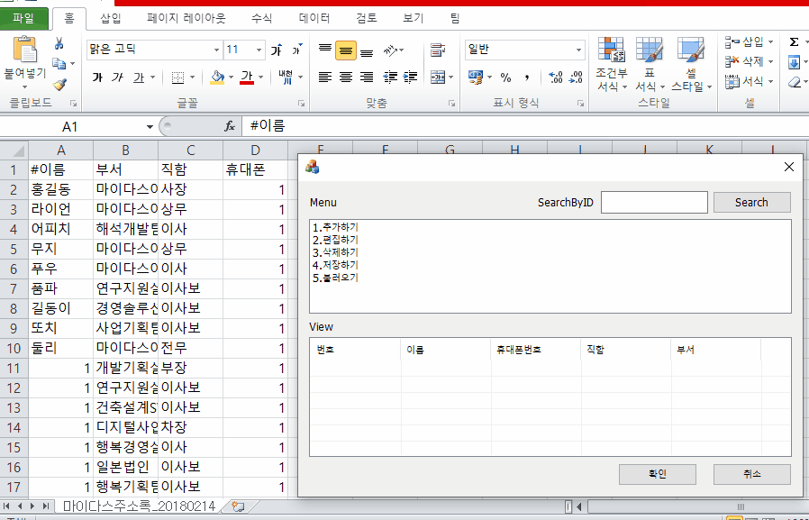
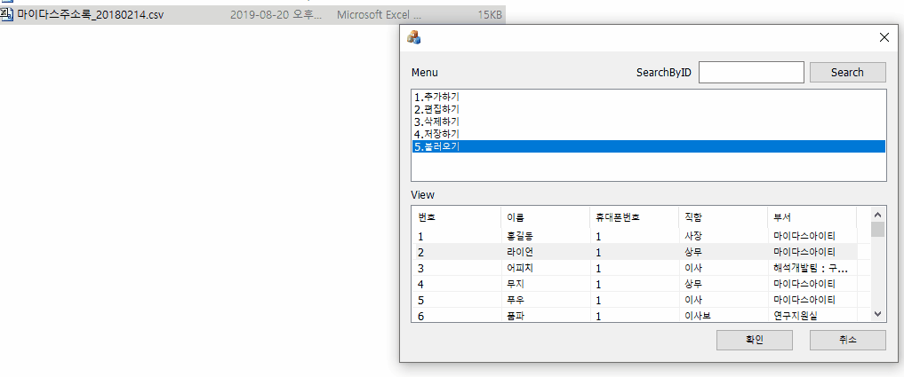
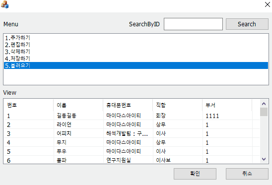
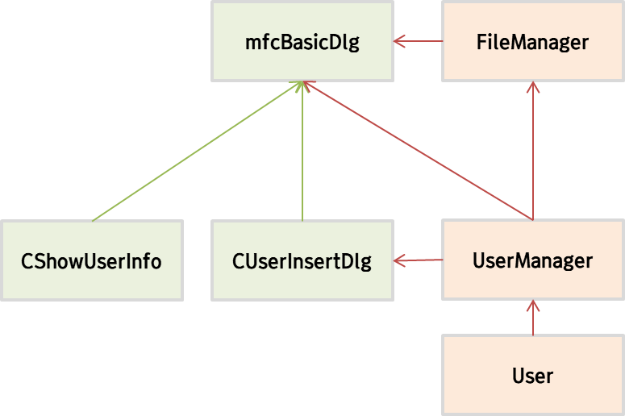

# MFC PhoneBook Program

### 구현 기능
---

**Insert**

----

**Edit**

----

**Show**

----

**Search**

----

**Delete**

----

**Load**

----

**Save**

----

**ShowImage**

----

### 프로그램 구조

**View Structure**

**Model Structure**

---
